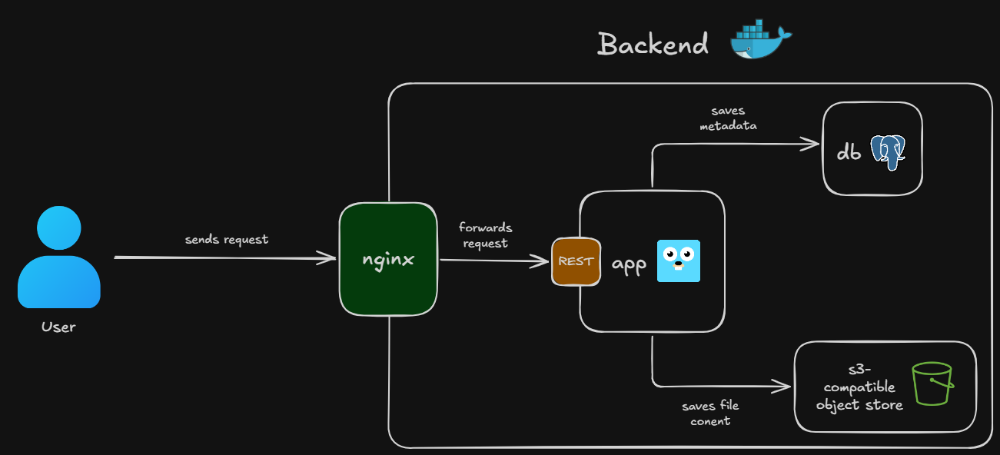
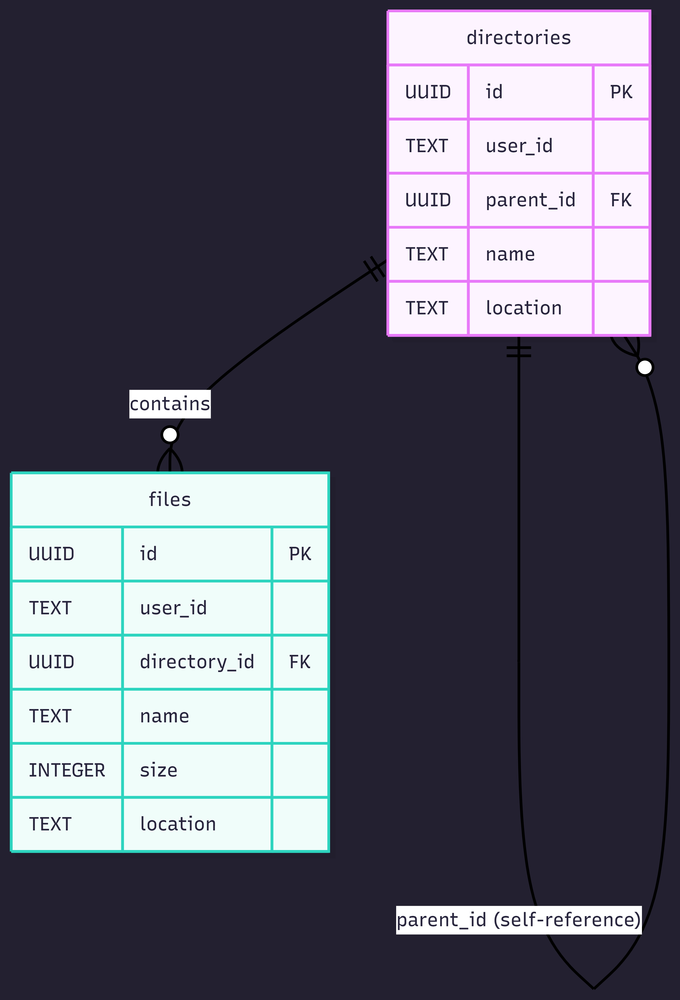

# What Is This Project?

This project is a backend for storing and managing files.

# The MVP

## Files

[x] upload

[x] download

[x] view (metadata only)

[x] remove

[x] update (metadata only)

## Directories

[] upload

[x] download

[x] create

[x] remove

[] update (metadata only)

[] find one (metadata only)

## Usage

[x] for one file

[] for one directory

[] for all files of specific user

[] quotas

## Authn & Authz

[] create account

[] log in

# How To Run

**Note**: This guide assumes you are in the repository root directory.

## Prerequisities:

- docker and docker compose installed on your system

## Development

To start in development mode run: `docker compose up -d --build`.

**Tip**: Install go and your editor's tooling for it to have better developer experience.

After starting the app REST API will be available on `http://localhost:8080`

## Production

To start in production mode run: `docker compose -f prod.compose.yaml up -d --build`

# Services

Backend consists of 4 services:

- reverse proxy (nginx)

- app service (golang REST API)

- database (postgres)

- file storage (s3-compatible object store)

| Service | Port |
| ------- | ---- |
| reverse proxy | 8080 |
| app service | not exposed |
| database | not exposed |
| file storage | not exposed |

# Architecture

## System design

### Request flow

System design is relatively simple. Every request is sent to reverse proxy, which takes care of encryption and load balancing. Reverse proxy then forwards it to the app service, which stores metadata (information about files and directories like name, location, user id, etc.) in SQL database and file contents in file storage.

**Note**: File storage does not care about directories. Every file is stored flat and is identified by unique UUID v4. Directories only exist in database, which creates illusion that files are organized in storage (they are not).

### Database

There are 2 tables: files and directories. Each row in files table has `directory_id` field, which points to the directory which owns that file. The column can be null if file is in the root. Each row in directories table has `parent_id` field, which points to the parent directory (illusion of nesting). The column can be null if directory is in the root.

## Code

### Structure

App service source code follows [SRP](https://www.geeksforgeeks.org/system-design/single-responsibility-in-solid-design-principle/) and 3-layer architecture:

- Presentation
- Business logic
- Persistence

Presentation layer consists of structs called `controllers`, which only take care about sending the right response to the user. They do NOT contain any business logic and call services (from business logic layer), which perform all operations. Example can be [FilesController](./services/files/internal/files/controller.go)

Business logic layer has structs called `services`, which perform business logic and act as orchestrators (file upload, directory download etc). They may delegate more complex tasks to other structs or functions. Services do NOT deal with persistence, instead they use repositories for that (persistence layer). Example can be [FilesService](./services/files/internal/files/service.go)

Persistence layer deals with - as the name implies - data persistence. It mainly consists of structs called `repositories`, which are wrappers around SQL queries. This design makes it easier for above layers to persist data without needing to wory about database-specific details. Example can be [PostgresFilesRepository](./services/files/internal/files/postgres-repository.go)

### Patterns

App service source code uses the following patterns for cleaner and more scalable code:

- [Dependency Injection](https://stackify.com/dependency-injection/)
- [Dependency Inversion](https://stackify.com/dependency-inversion-principle/)

Dependency injection is principle forces classes to accept their dependencies as parameters. In combination with dependency inversion this pattern enables developers to write code that is clean, readable, testable and scalable. Example of this pattern in code is [IFilesRepository](./services/files/internal/files/interfaces/respository.go).

# REST API

API endpoints are listed and documented on [apidog](https://mx3hqpvt7q.apidog.io/). 

# Contribution

Contribution rules are [here](./CONTRIBUTING.md).
